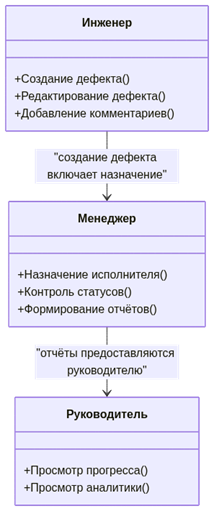
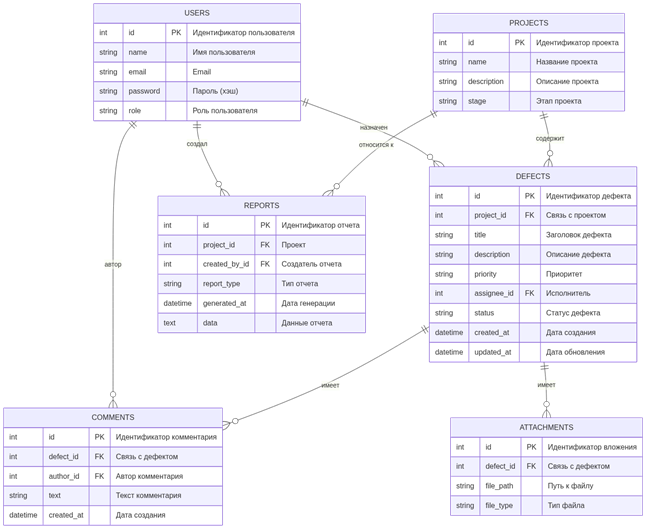

# Функциональные требования

1.  Регистрация пользователей и аутентификация.
2.  Разграничение прав доступа (менеджер, инженер, наблюдатель).
3.  Управление проектами/объектами и их этапами.
4.  Создание и редактирование дефектов (заголовок, описание, приоритет, исполнитель, сроки, вложения).
5.  Управление статусами дефектов: Новая → В работе → На проверке → Закрыта/Отменена.
6.  Ведение комментариев и истории изменений.
7.  Поиск, сортировка и фильтрация дефектов.
8.  Экспорт отчётности в CSV/Excel.
9.  Просмотр аналитических отчётов (графики, статистика).

# Нефункциональные требования

*   Время отклика страницы ≤ 1 секунды (для 50 активных пользователей).
*   Обеспечить резервное копирование БД раз в сутки.
*   Интерфейс на русском языке, адаптивный под ПК/планшеты.
*   Совместимость с Chrome/Firefox/Edge последних версий.
*   Пароли хранить с использованием bcrypt или argon2.
*   Защита от SQL-инъекций, XSS и CSRF.

# Пользовательские роли и полномочия

| Роль / Заказчик          | Основные действия                                                                 | Ограничения                                                                       |
| :----------------------- | :-------------------------------------------------------------------------------- | :-------------------------------------------------------------------------------- |
| **Инженер**              | Создание и редактирование дефектов, добавление комментариев, прикрепление файлов  | Не может назначать задачи другим, не может закрывать дефекты без проверки менеджера |
| **Менеджер**             | Назначение исполнителей, установка сроков, контроль статусов, формирование отчётов | Не может удалять проекты без прав руководителя, не редактирует чужие комментарии  |
| **Руководитель** | Просмотр прогресса, аналитика, отчёты                                             | Не может создавать или редактировать дефекты, не назначает задачи                 |

# Use Case диаграмма

# User Stories

*   **Инженер:**
    Как инженер, я хочу создавать дефекты с фото и описанием, чтобы менеджер мог их отслеживать.
*   **Менеджер:**
    Как менеджер, я хочу назначать дефекты исполнителям и устанавливать сроки, чтобы работа выполнялась вовремя.
*   **Руководитель:**
    Как руководитель, я хочу просматривать отчёты и графики по дефектам, чтобы контролировать работу проекта.
*   **Инженер / Менеджер:**
    Как пользователь, я хочу видеть историю изменений и комментарии к дефектам, чтобы понимать, кто и когда что сделал.
*   **Менеджер / Руководитель:**
    Как пользователь, я хочу экспортировать отчёты в Excel, чтобы анализировать данные и готовить документы для руководства.

# Архитектура приложения

Монолитное веб-приложение с тремя основными слоями:

*   **Слой представления (Frontend)**
    *   Реализует пользовательский интерфейс
    *   Интерактивные формы для создания/редактирования дефектов, просмотр отчётов
    *   Технологии: Vue
*   **Слой бизнес-логики (Backend)**
    *   Обрабатывает все операции с данными и правила безопасности
    *   Контроллеры для Users, Projects, Defects, Reports
    *   Проверка прав доступа (RBAC)
    *   Технологии: Java (Spring Boot)
*   **Слой данных (Database)**
    *   Реляционная база данных PostgreSQL
    *   Таблицы: Users, Projects, Defects, Comments, Attachments, Reports
    *   Связи между таблицами по FK

# ER-диаграмма

